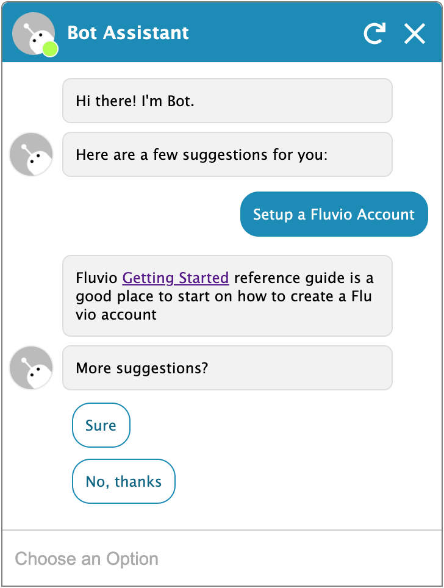

# Bot Assistant

This project provides an example on how to write you own Robot Assistant. The product uses Fluvio data streaming for storage, Typescript for the server, and Javascript for the client.

<p align="center"></p>

**Note:**
The server uses Fluvio data streaming for storage and message exchanges. If you don't have Fluvio installed, checkout [Getting Started](https://fluvio.io/docs/getting-started).

Checkout [Build Your Own Custom Robot Assistant](blog/2020/12/bot-assistant/) for the step-by-step instructions,.

### Run Bot Assistant

Open a new terminal window, navigate to `./bot-assistant` directory, and perform the following operations:

```bash
npm run setup
```

Setup creates the fluvio topic. You only need to run this operation one time.

```bash
PARAMS=state-machines/fluvio.json npm run start:server
```
The server connects to Fluvio and listens for client messages. If the server successfully started, you should see the following message:

```bash
...
┌───────────────────┬─────┬────────┐
│ (iteration index) │ Key │ Values │
├───────────────────┼─────┼────────┤
└───────────────────┴─────┴────────┘
started bot assistant server at http://localhost:9998...
```

Open the web browser at `http://localhost:9998` to interact with bot assistant.