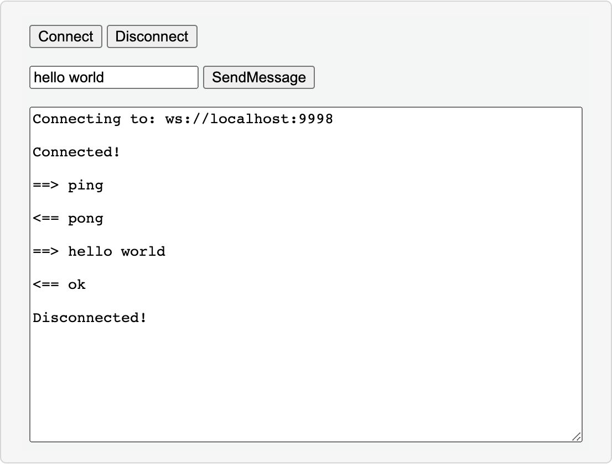

# WebSocket Glue

This project provides an example on how to write a websocket glue.

## Build Project

Install packages and run server in development node

```bash
npm install
npm run start:dev
```

Open the web browser and refresh http://localhost:9998/.

<p align="center"></p>

Read the blog: [Websocket Glue for Data Streaming Apps](https://fluvio.io/blog/2020/12/websocket-glue-for-streaming-apps/) for additional information.